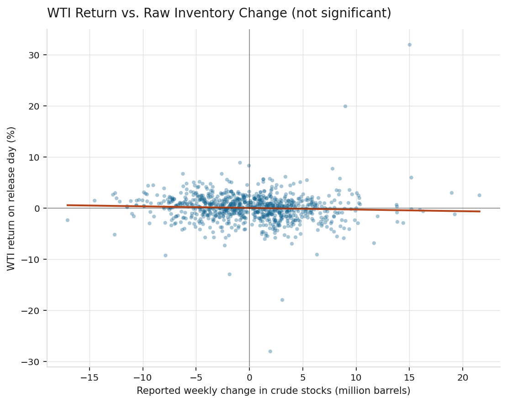
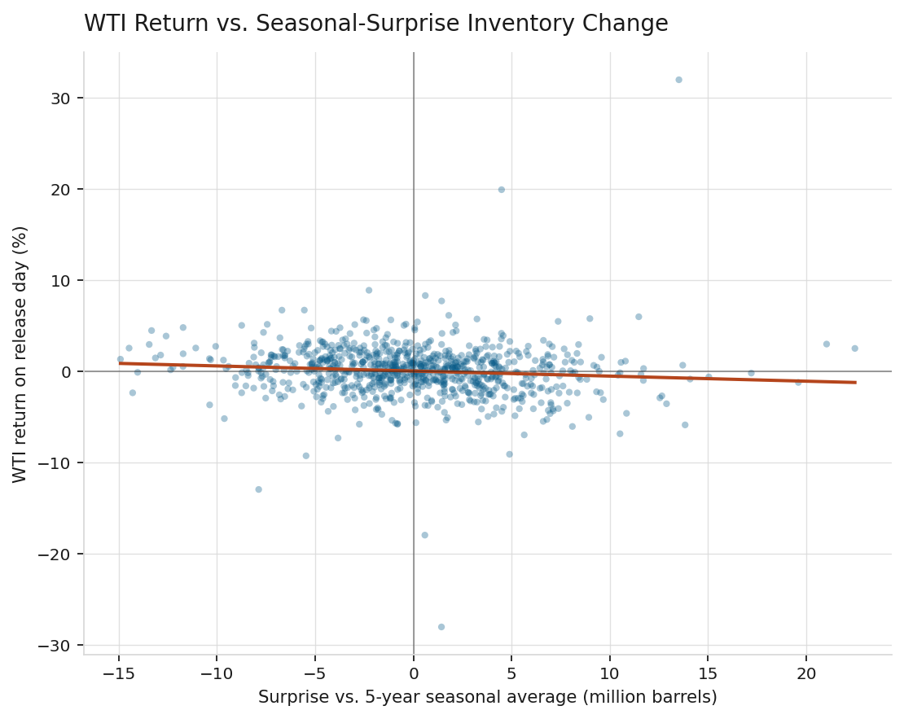
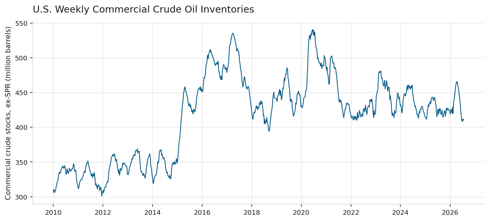
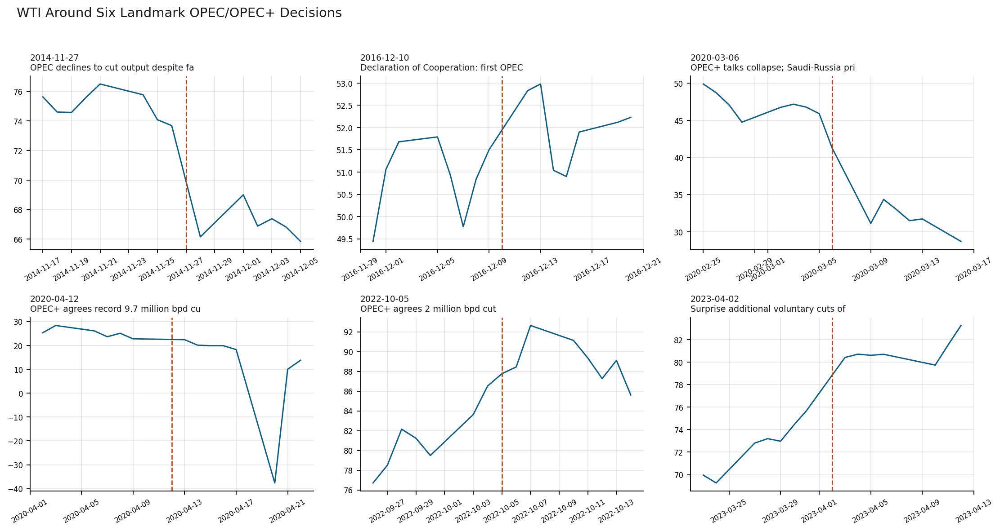

# Inventory Surprises, Supply Shocks, and the Price of Crude Oil: An Applied Test of Supply and Demand

**Jack Cooper Warrington**
Student at the University of Denver

*Methods: OLS regression, seasonal decomposition, Granger causality, event study*

*Data & tools: Python, statsmodels, EIA weekly inventory data, WTI futures, OPEC decision dates*

---

## Abstract

This paper tests a basic prediction of supply and demand theory: at fixed demand, more supply should push price down, and less should push it up. Two applications are examined. First, using the U.S. Energy Information Administration's (EIA) Weekly Petroleum Status Report from 2010 through 2026, this paper tests whether West Texas Intermediate (WTI) crude oil prices respond to weekly changes in U.S. commercial crude oil inventories. A regression of price returns on the raw reported change finds no statistically significant relationship (p = 0.112). Once the raw change is split into an expected seasonal component and a surprise component, using the same seasonal-adjustment convention the EIA uses in its own reporting, the surprise component is a significant negative predictor of price returns (coefficient = −0.056, p = 0.005): a larger-than-usual build predicts a lower price, and a larger-than-usual draw predicts a higher price. A Granger causality test shows this prediction runs one direction only: past surprises predict future returns at one and two weeks (p = 0.009, p = 0.029), but past returns do not predict future surprises at any tested lag (p > 0.10). The surprise-return relationship is strong in the 2010-2019 subsample (coefficient = −0.125, p < 0.001) and statistically zero in 2020-2026 (coefficient = 0.002, p = 0.961). Second, an event study of six OPEC and OPEC+ production decisions finds price moved in the predicted direction in five of six cases; the one exception is explained by a demand shock large enough to offset the supply cut. All analysis uses ordinary least squares (OLS) regression. Reproducible Python code and full model output are provided in the repository.

---

## 1. Introduction

Supply and demand theory holds that at fixed demand, more of a good available should push its price down, and less should push it up. Crude oil is closely watched because its supply and demand conditions are measured and reported on a public schedule, and its price is set continuously on global futures markets. This paper tests the theory two ways.

The first uses inventories. The quantity of a good sitting in storage signals the balance between production and consumption. If production exceeds consumption, inventories build; if consumption exceeds production, they draw down. The U.S. government measures this for crude oil every week and publishes it in the EIA's Weekly Petroleum Status Report, the most closely watched recurring data release in the oil market. This paper asks: does the market respond to this signal the way theory predicts?

The second uses production decisions by the Organization of the Petroleum Exporting Countries (OPEC), a coalition of oil-producing nations that coordinates output to influence the global price of crude oil. Since 2016, OPEC has often acted jointly with other oil producers, including Russia; this extended group is called OPEC+. OPEC and OPEC+ together control enough of world oil production that their output decisions are widely treated as deliberate attempts to move price. Unlike the weekly inventory signal, these decisions are discrete: producers explicitly agree to raise or lower output. This paper asks whether price moved in the direction each decision intended, using six documented decisions from the last fifteen years.

The central finding is that a naive test of the inventory signal fails: regressing returns on the raw weekly inventory change finds no significant relationship. The reason, developed in Section 2.2, is that much of the weekly change is not news. Refinery maintenance season and summer driving season are known in advance, and prices should already reflect them before release. Splitting the raw change into an expected seasonal component and a surprise component, and testing the surprise alone, produces a relationship that is significant and matches theory. A Granger causality test then asks which direction the relationship runs.

## 2. Background and theoretical framework

### 2.1 Inventories as a signal of the supply-demand balance

Crude oil prices are set by a mix of physical supply and demand fundamentals, financial market activity, and expectations about the future, with no single factor dominating at all times (Hamilton, 2009). Inventories are one of the clearest fundamentals-based signals available, since the EIA states that because petroleum inventories buffer supply and demand shifts, "inventory levels are closely tied to the relationship between the current oil price and expectations about future oil prices" (U.S. Energy Information Administration, n.d.). A faster-than-usual inventory build signals supply outrunning demand at the current price, and theory predicts price should fall to restore balance. A faster-than-usual draw signals the reverse.

### 2.2 The surprise versus the anticipated

Bu (2014) studies crude oil futures volatility around the EIA's weekly release and finds that information shocks in the report, not the raw level of the change, move prices. Miao, Ramchander, Wang, and Yang (2018) study the same release in futures and options markets and find futures prices decline after larger-than-expected builds and rise after larger-than-expected draws, with no similar effect from the anticipated portion of the change.

This distinction follows from rational expectations: information knowable in advance should already be priced in, so only the surprise component should move price on release day. A regression on the raw reported change should therefore understate or miss the relationship, since much of that number was already expected. Section 4.2 builds a surprise measure to test this.

### 2.3 OPEC as a discrete supply-side intervention

OPEC and OPEC+ production decisions are discrete interventions intended to move price by adjusting supply. Schmidbauer and Rösch (2012) study OPEC news announcements and find they carry information content distinct from routine data releases. OPEC does not meet on a fixed annual schedule, and no free, machine-readable calendar of every OPEC decision exists. Section 4.4 therefore restricts its event study to a small number of decisions that are documented turning points in oil market history.

## 3. Data

Three sources are used, all public and free.

**U.S. commercial crude oil inventories**, excluding the Strategic Petroleum Reserve, come from the EIA's public historical data file at eia.gov, no registration or key required. The series is weekly, in thousand barrels, from 1982 to the present; this paper uses January 2010 through July 2026, 864 weekly observations.

**WTI front-month futures prices** come from Yahoo Finance via the `yfinance` Python library, January 2005 through July 2026, to provide history for computing returns around each release.

**OPEC and OPEC+ decision dates** for Section 5.4 were compiled individually and checked against multiple news sources (Reuters, CNBC, the Washington Post, NPR, Al Jazeera, and OPEC's own press releases), since no single free, complete calendar of OPEC decisions exists.

## 4. Methodology

### 4.1 The naive test

For each EIA report, the week-over-week change in commercial crude inventories is computed in million barrels. The EIA releases the report at 10:30 AM Eastern on the Wednesday following each week-ending date (a Friday), five calendar days later, with holiday delays to Thursday or occasionally Friday. Because no single published file lists every holiday-adjusted release date, the release date here is the first trading day at least five calendar days after the week-ending date. This will be off by one day in an estimated 6 to 8 holiday-affected weeks per year, adding noise but not a systematic bias. Section 7 discusses this further.

The naive regression is:

*return_pct = a + b × change_mmbbl + ε*

where *return_pct* is the WTI daily log return, in percent, on the release day, and *change_mmbbl* is the raw reported inventory change, in million barrels.

### 4.2 The surprise test

For each week, a seasonal expectation is built as the average reported change in the same calendar week (by ISO week number) over the trailing five years, matching the "five-year average" comparison the EIA itself uses. The surprise is then:

*surprise_mmbbl = change_mmbbl − seasonal_expected*

The surprise regression is:

*return_pct = a + b × surprise_mmbbl + ε*

The EIA does not publish what the market expected each week; that consensus figure is proprietary, sold by services such as Bloomberg, and is the measure used in Miao et al. (2018). The seasonal-average measure here is a free, reproducible substitute, not equivalent to the true market consensus. Section 7 discusses what that substitution does and does not allow this paper to conclude.

### 4.3 Granger causality

A Granger causality test asks whether past values of one variable improve a prediction of another variable beyond that variable's own past. It is a test of predictive content, not causation in the everyday sense. Two regressions are compared. To test whether surprises predict returns:

*return(t) = a + Σ b_k · return(t−k) + Σ c_k · surprise(t−k) + ε(t)*

against the restricted version with the c terms removed. If the c terms are jointly significant, surprises Granger-cause returns. The reverse direction, testing whether returns predict surprises, swaps the roles of the two variables. Both directions are tested at lags of one through four weeks.

### 4.4 The OPEC event study

Six OPEC and OPEC+ decisions were selected as documented, unambiguous turning points, avoiding a longer list of routine meetings that would carry more risk of compiled error without a single source to check against. For each event, the WTI log return, in percent, on the event day and the following trading day is measured, along with the cumulative two-day return. Each event was classified before observing the price reaction as theoretically bullish (an announced cut, which should raise price) or bearish (a decision not to cut, or a breakdown that raises supply, which should lower price), based on the substance of the decision as reported at the time.

### 4.5 Robustness checks

Two checks are run on the surprise regression. First, the sample is split at January 1, 2020, separating the pre-COVID period from the COVID-19 shock and its aftermath. Second, the seasonal window is varied between 3, 5, and 7 years to test whether the result depends on that choice.

## 5. Results

### 5.1 The naive test fails; the surprise test succeeds

Over 864 weekly reports, the raw reported change has a correlation of −0.054 with the same-day WTI return, and the naive regression coefficient is not significant.

**Table 1: Naive regression of WTI return on raw inventory change**

| Coefficient | Estimate | Std. error | p-value |
|---|---|---|---|
| Intercept | 0.052 | 0.099 | 0.598 |
| Raw change (mmbbl) | −0.032 | 0.020 | 0.112 |



*Figure 1: WTI return on the release day against the raw reported inventory change. The fitted slope is not distinguishable from zero.*

Splitting the raw change into seasonal-expected and surprise components changes the result. The correlation with return nearly doubles, to −0.096, and the coefficient becomes significant.

**Table 2: Surprise regression of WTI return on seasonal-surprise inventory change**

| Coefficient | Estimate | Std. error | p-value |
|---|---|---|---|
| Intercept | 0.050 | 0.099 | 0.611 |
| Surprise (mmbbl) | −0.056 | 0.020 | 0.005 |



*Figure 2: WTI return on the release day against the surprise component of the inventory change. The negative slope is significant at the 1 percent level.*

The negative sign matches theory: a larger-than-expected build corresponds to a lower price, and a larger-than-expected draw to a higher price. The naive regression misses this; the surprise regression finds it. This gap is the paper's main methodological finding: much of the raw weekly change is already anticipated, and only the surprise carries price-moving information, consistent with Bu (2014) and Miao et al. (2018).

Figure 3 shows the inventory series for context.



*Figure 3: U.S. commercial crude oil inventories excluding the Strategic Petroleum Reserve, 2010-2026.*

### 5.2 Which direction does the relationship run?

The regression in Section 5.1 is same-week: it tests whether the surprise and the return move together in the same week, without saying which moves first. Table 3 reports the Granger causality test in both directions.

**Table 3: Granger causality between inventory surprises and WTI returns**

| Direction | Lag (weeks) | F-statistic | p-value |
|---|---|---|---|
| Surprise → Return | 1 | 6.887 | 0.009 |
| Surprise → Return | 2 | 3.560 | 0.029 |
| Surprise → Return | 3 | 2.335 | 0.073 |
| Surprise → Return | 4 | 1.855 | 0.116 |
| Return → Surprise | 1 | 2.604 | 0.107 |
| Return → Surprise | 2 | 0.831 | 0.436 |
| Return → Surprise | 3 | 1.270 | 0.284 |
| Return → Surprise | 4 | 1.342 | 0.253 |

Past surprises predict future returns at one week (p = 0.009) and two weeks (p = 0.029), losing significance by three and four weeks. Past returns do not predict future surprises at any tested lag (p > 0.10 throughout). The relationship runs one direction: from surprise to price, not the reverse.

Two things follow from this. First, the market does not appear to anticipate the inventory number before release; if it did, past returns would predict future surprises, and they do not. Second, the surprise's effect on price is not resolved in a single day. A one- to two-week lag before the effect fades suggests the market takes more than one trading session to fully incorporate the surprise into price, rather than adjusting completely on release day.

### 5.3 Robustness: stable in magnitude, weaker since 2020

Splitting the sample at January 1, 2020 shows a clear break.

**Table 4: Subsample stability of the surprise regression**

| Period | n | Coefficient | p-value | Correlation |
|---|---|---|---|---|
| 2010-2019 | 520 | −0.125 | < 0.001 | −0.240 |
| 2020-2026 | 341 | 0.002 | 0.961 | 0.003 |

Before 2020, the relationship is more than twice as strong as in the full sample. After 2020, it is statistically and economically zero. Section 6 discusses possible reasons.

Varying the seasonal window leaves the sign and approximate size of the effect unchanged, though significance depends on sample size.

**Table 5: Sensitivity to the seasonal window length (full sample)**

| Seasonal window | n | Coefficient | p-value | Correlation |
|---|---|---|---|---|
| 3 years | 393 | −0.061 | 0.066 | −0.093 |
| 5 years | 861 | −0.056 | 0.005 | −0.096 |
| 7 years | 861 | −0.050 | 0.016 | −0.082 |

The coefficient stays negative and similar in size (−0.050 to −0.061) across all three windows, so the effect is not an artifact of the five-year choice. The 3-year window has a smaller usable sample (393 versus 861), since it still requires 3 years of prior history to compute a seasonal average, which costs more of the available range than the 5- or 7-year cases given this paper's 2010 start date. The resulting loss of power likely explains why the 3-year case misses the 5 percent threshold (p = 0.066) despite a similar coefficient.

### 5.4 The OPEC event study

Table 6 reports the price reaction around each of the six decisions.

**Table 6: WTI reaction to six OPEC/OPEC+ decisions**

| Date | Decision | Expected direction | Return, day 0 | Return, day +1 | Cumulative |
|---|---|---|---|---|---|
| 2014-11-27 | OPEC declines to cut output | Bearish | −10.79% | +4.22% | −6.58% |
| 2016-12-10 | First OPEC+ deal (Declaration of Cooperation) | Bullish | +2.55% | +0.28% | +2.83% |
| 2020-03-06 | OPEC+ talks collapse; Saudi-Russia price war begins | Bearish | −10.61% | −28.22% | −38.83% |
| 2020-04-12 | OPEC+ agrees record 9.7 million bpd cut | Bullish | −1.55% | −10.83% | −12.38% |
| 2022-10-05 | OPEC+ agrees 2 million bpd cut | Bullish | +1.42% | +0.78% | +2.21% |
| 2023-04-02 | Surprise additional voluntary cuts (1.16 million bpd) | Bullish | +6.09% | +0.36% | +6.45% |



*Figure 4: WTI price in the twenty trading days around each decision, with the decision date marked.*

Five of six events moved as expected. The exception, April 12, 2020, is explainable rather than a contradiction: that agreement was reached during the COVID-19 demand collapse, when global demand had fallen sharply and by an amount still uncertain at the time. Price kept falling even as a record supply cut was announced, meaning the market judged the 9.7 million barrel per day cut insufficient to offset the drop in demand. This is a demand shock overwhelming a supply-side move, not a failure of the theory: price responds to the net of supply and demand shocks, not to a supply announcement alone.

March 6, 2020 shows the largest reaction in the sample, a cumulative two-day decline of nearly 39 percent, consistent with news accounts from that period describing the Saudi-Russia price war as one of the largest oil market shocks in decades.

## 6. Discussion

The main finding is as much methodological as substantive: the same relationship, price responding to a supply shift, is invisible in a naive test and visible once the test isolates a data release's surprise component from its anticipated component. Any test of how markets respond to scheduled, recurring information should ask whether the raw level of a variable is the right test, or only the deviation from what was expected.

The Granger causality result adds a specific piece of information the same-week regression cannot supply: direction. Surprises predict future returns; returns do not predict future surprises. This rules out one alternative explanation for the Section 5.1 result, that the market was simply anticipating the inventory number and returns were leading the announcement rather than following it. The one- to two-week decay in predictive power also indicates the market's adjustment to a surprise is not complete within a single trading day.

The subsample break in Section 5.3 is a real structural change, since it survives the robustness checks run there. Three explanations seem possible, none confirmed by this data. First, 2020-2026 compresses a wider range of market regimes into a short span, including the COVID-19 demand collapse, the negative-price episode, a rapid recovery, the Russia-Ukraine invasion and its sanctions, and a subsequent tightening and loosening cycle, any of which could make seasonal patterns a worse guide to what the market expected in a given week. Second, the seasonal-surprise measure itself may be less reliable in this period, since the seasonal patterns it is built from were disrupted by the same events, exactly when the relationship it measures would be most useful to observe. Third, a period of unusually high macroeconomic and geopolitical volatility may have added enough other sources of daily price variation that one weekly release became a smaller share of total price-moving news.

The OPEC event study makes a related point: the theory predicts how price responds to a given shift in supply, holding the demand side fixed. April 2020 shows what happens when that assumption fails: a large supply cut met an even larger demand collapse, and price followed the demand side. This does not weaken the paper's main claim; it clarifies what the theory does and does not predict on its own.

## 7. Limitations

**The release date is approximated, not matched to a verified EIA schedule.** Section 4.1 uses the first trading day at least five calendar days after each week-ending date, since no single free, complete file of holiday-adjusted release dates across 2010-2026 could be located. This adds a timing error of about one day in an estimated 6 to 8 weeks per year. This noise should weaken rather than manufacture the estimated relationship, so the true relationship may be somewhat stronger than reported here.

**The seasonal-surprise measure substitutes for, but does not equal, actual market expectations.** Miao et al. (2018) use proprietary Bloomberg survey data to measure the market's actual weekly expectation; that data is not free. The seasonal average used here is reproducible but will differ from the true consensus in any week where news beyond typical seasonal patterns had already shifted expectations before release.

**OLS standard errors assume no autocorrelation in the residuals.** The weekly releases used here are non-overlapping, so the overlap-induced autocorrelation that arises from overlapping time windows does not apply. Financial time series can still show autocorrelation from other sources, such as volatility clustering, and HAC standard errors following Newey and West (1987) would be a reasonable check for future work.

**The Granger test uses a maximum lag of four weeks** and a linear specification; it does not test for nonlinear predictive relationships or account for possible seasonality within the surprise series itself, beyond what has already been removed in constructing the surprise measure.

**Six OPEC events limits formal statistical inference.** This is not enough for a meaningful t-statistic the way a larger event study would support. Section 5.4 is a structured case study, not a hypothesis test, and its conclusions should be read as illustrative and consistent with theory, not as established at a stated significance level.

**Front-month WTI futures carry roll effects** not adjusted for here. As a contract nears expiration, trading shifts to the next contract month, and this series does not correct for the resulting discontinuities.

## 8. Conclusion

This paper tests whether price responds to shifts in available supply, using two applications to the crude oil market. Using the EIA's weekly inventory report, a naive test on the raw reported change finds no significant relationship, but isolating the surprise component, the deviation from a seasonal expectation, finds a negative, significant relationship matching theory and the existing literature on this release (Bu, 2014; Miao et al., 2018). A Granger causality test shows the relationship runs from surprise to price, not the reverse, with predictive power lasting one to two weeks. The relationship is stable in size before 2020 and statistically zero after, a structural break discussed in Section 6. Second, an event study of six OPEC and OPEC+ decisions finds price moved as predicted in five of six cases, with the exception explained by a demand shock large enough to offset the supply cut.

Extensions that would improve this work: a verified historical calendar of EIA release dates, including holiday adjustments, would remove the timing approximation in Section 7. Bloomberg or Reuters consensus survey data, following Miao et al. (2018), would let the surprise measure use actual market expectations rather than a seasonal proxy. A larger, systematically compiled set of OPEC decisions, once a reliable free calendar exists, would support more formal statistical testing than the current case study. Investigating the post-2020 break directly, testing whether it is explained by the specific regime shifts named in Section 6, would be a natural next step.

---

## References

Bu, H. (2014). "Effect of Inventory Announcements on Crude Oil Price Volatility." *Energy Economics* 46: 485–494.

Hamilton, J. D. (2009). "Understanding Crude Oil Prices." *The Energy Journal* 30 (2): 179–206.

Miao, H., S. Ramchander, T. Wang, and J. Yang (2018). "The Impact of Crude Oil Inventory Announcements on Prices: Evidence from Derivatives Markets." *Journal of Futures Markets* 38 (1): 38–65.

Newey, W. K. and K. D. West (1987). "A Simple, Positive Semi-Definite, Heteroskedasticity and Autocorrelation Consistent Covariance Matrix." *Econometrica* 55 (3): 703–708.

Schmidbauer, H. and A. Rösch (2012). "OPEC News Announcements: Effects on Oil Price Expectation and Volatility." *Energy Economics* 34 (5): 1656–1663.

U.S. Energy Information Administration (n.d.). "What Drives Crude Oil Prices: Balance." Retrieved from eia.gov/finance/markets/crudeoil/balance.php.

---

## Appendix A: Code and reproducibility

All analysis is reproducible with the following scripts, included in this repository:

- `inventory_elasticity.py`: EIA data download, seasonal-surprise construction, naive and surprise regressions, Granger causality test (Sections 5.1-5.2)
- `robustness.py`: Subsample and seasonal-window checks (Section 5.3)
- `opec_event_study.py`: OPEC/OPEC+ event study (Section 5.4)
- `notebook.ipynb`: Interactive walkthrough of all analyses

To reproduce all results:

```
pip install -r requirements.txt
python inventory_elasticity.py
python robustness.py
python opec_event_study.py
```

Full model output, including complete regression summaries, is in the `results/` directory. All charts are generated by the scripts and stored in `charts/`. EIA inventory data and WTI prices are downloaded live from their public sources each run; no static data file or API key is required.

## Appendix B: Data sources

- U.S. commercial crude oil inventories (excluding SPR): U.S. Energy Information Administration, public historical data file at eia.gov, no API key required
- WTI front-month futures prices: Yahoo Finance via the `yfinance` Python library
- OPEC/OPEC+ decision dates: verified against Reuters, CNBC, the Washington Post, NPR, Al Jazeera, and OPEC's own press releases

## Appendix C: A note on the OPEC event list

The six events in Section 5.4 were not drawn from a single compiled calendar, since no free, complete, machine-readable calendar of every OPEC or OPEC+ meeting and decision currently exists. Each event's date and substance was checked individually against multiple news sources from the time. This list is not exhaustive and is not a systematic sample of all OPEC decisions; it is a small set of decisions regarded, at the time and since, as turning points in the oil market.
